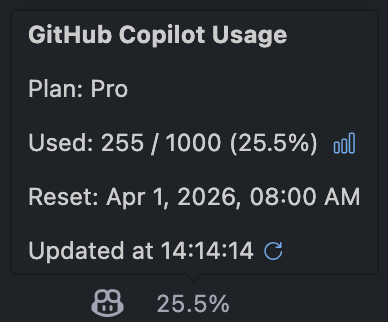
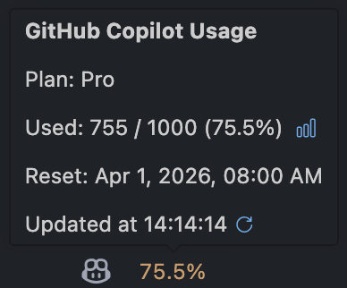
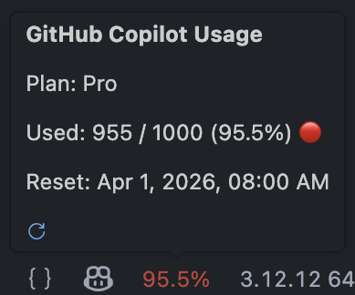

# GitHub Copilot Usage

  
Shows Copilot Premium request quota usage in the VS Code status bar, right next to the Copilot icon.

  
e.g., <code>25%</code> normal · <code>75%</code> yellow warning · <code>95%</code> red critical.

## Features

- **Status bar**: shows used percentage (`15%`), turns yellow/red near threshold
- **Hover tooltip**: plan, used / quota, overage (if any), reset date
- **Auto-refresh**: configurable interval (default 5 min)
- **Zero config**: uses your existing VS Code GitHub account sign-in

| | | |
| :---: | :---: | :---: |
|  |  |  |
| Normal | Warning | Critical |

## Status bar states

| Display | Meaning |
|---------|---------|
| `25%` | Normal usage |
| `75%` (yellow) | Warning threshold reached |
| `90%` (red) | Critical threshold reached |
| `∞` | Unlimited plan |
| `—` | No premium quota data (plan has no tracked limit) |
| `Sign in` | Not signed in — click to sign in |
| _(spinner)_ | Loading |
| _(error icon)_ | API / network error |

## License

Under the [MIT](LICENSE) License.
