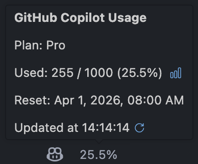
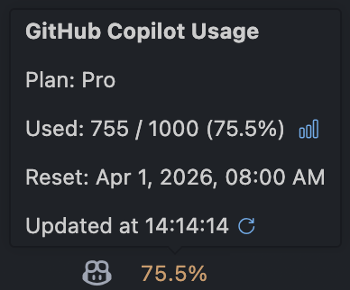
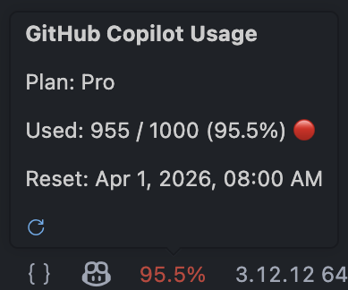

# GitHub Copilot Usage

Show GitHub Copilot usage in the VS Code status bar, right next to the Copilot icon. Supports Premium Requests and Credits.

## Features

- **Status bar**: shows used percentage (`15%`), turns yellow/red near threshold
- **Hover tooltip**: shows plan, usage, overage, reset date, last update, refresh button, and [AI usage](https://github.com/settings/billing/ai_usage)
- **Auto-refresh**: configurable interval (default 5 min)
- **Zero config**: uses your existing VS Code GitHub account sign-in

<!-- prettier-ignore -->
| | | |
| :---: | :---: | :---: |
|  |  |  |
| Normal | Warning | Critical |

## Status bar states

| Display        | Meaning                                                         |
| -------------- | --------------------------------------------------------------- |
| `25%`          | Normal usage                                                    |
| `75%` (yellow) | Warning threshold reached                                       |
| `90%` (red)    | Critical threshold reached                                      |
| `100%` (red)   | Pooled entitlement exhausted (enterprise unlimited, no overage) |
| `111%` (red)   | Overage — actual usage exceeds quota                            |
| `∞`            | Unlimited plan                                                  |
| `—`            | No quota data to display                                        |
| `⟳`            | Loading                                                         |
| `✕`            | Server error or access denied                                   |
| `⚠`            | Offline or rate limited — no cached data available              |
| `25% ⚠`        | Last known data — offline for > 1 hour                          |
| `Sign in`      | Not signed in — click to sign in                                |

## You may also like

-  [**Claude Skills for Copilot**](https://marketplace.visualstudio.com/items?itemName=euxx.claude-skills-for-copilot) - Agent skills for GitHub Copilot: code review, feature dev, frontend design, and more
-  [**Editor Tweaks**](https://marketplace.visualstudio.com/items?itemName=euxx.editor-tweaks) - A collection of small VS Code editor utilities packed into a single extension

## License

Under the [MIT](LICENSE) License.
